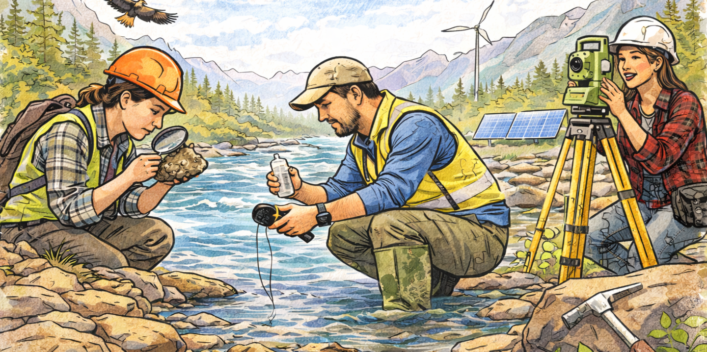

<!-- =========================================================
  Lesson Plan Markdown Template (K–12)
  NOTE: GitHub renders Markdown with its own fonts/styles.
  This file uses clean structure + subtle design elements
  (dividers, callouts, consistent headings) for a polished look.
========================================================== -->

# **Lesson 1: Discovering the World of Geoscience**
**Grade Level:** 4th and 5th Grade  
**Subject:** Science  
**Duration:** 1 hour  

---

## **LEARNING OBJECTIVE**
Students will be able to understand the role of geoscientists and the importance of their work in relation to environmental topics.

---

## **ASSESSMENTS**
Students will create a simple poster that illustrates what a geoscientist does and how it relates to environmental science. They will present their posters to the class to demonstrate their understanding.

---

## **KEY POINTS**
- **Definition of Geoscience:** Understanding what geoscientists study, including rocks, soil, water, and the Earth's processes.  
- **Environmental Impact:** How geoscientists contribute to environmental protection and sustainability.  
- **Career Paths:** Different careers within geoscience and related fields.  
- **Hands-on Activity:** The importance of hands-on learning in understanding geoscience concepts.  

---

## **OPENING**
- Begin with a question: **"What do you think a scientist who studies the Earth does?"**  
- Engage students with a short video clip showing geoscientists at work.  
- Discuss the video briefly to gather initial thoughts.  

---

## **INTRODUCTION TO NEW MATERIAL**
- Explain the role of geoscientists in studying the Earth and its environment.  
- Use visuals, such as images of geoscientists in the field, to enhance understanding.  
- Anticipate misconceptions, such as the idea that geoscience is only about rocks and minerals; clarify that it also includes water, air, and ecosystems.  

---

## **GUIDED PRACTICE**
- Divide students into small groups and provide them with images of different geoscience careers.  
- Allow groups to discuss what they see and present to the class.  
- Scaffold questioning: **"What tools might they use?"**, **"How do their findings impact our environment?"**  
- Monitor performance by circulating among groups and providing feedback.  

---

## **CLOSING**
- Have each student share one new thing they learned about geoscience?  
- Conclude with a reflection question: **"How can we help protect our environment based on what geoscientists teach us?"**  

---

## **STANDARDS ALIGNED**
- **TEKS 112.5.4.B:** Explore and recognize the importance of Earth and space systems.  
- **TEKS 112.5.4.C:** Investigate the impact of human activities on Earth systems.  
- **TEKS 112.5.4.D:** Describe the role of scientists in understanding and solving environmental issues.  

---

# **HANDS-ON ACTIVITY**
---

## **Goal**
Students will make a simple mini-poster showing what a geoscientist does and how their work helps protect the environment.

---

## **1. Create a Mini Poster (20 minutes)**
On a half-sheet or full sheet of paper, students should include:  
- A title  
- 2 facts (in their own words) about geoscientists  
- At least 2 key words (see vocabulary below)  

---

## **2. Quick Share (5 minutes)**
- Choose some groups to share their posters with the class

---

## **Materials Needed**
- Sheet of blank paper  
- Crayons, markers, or colored pencils  
- Scissors and glue  
- Printed images related to Geoscience  

---

## **Key Vocabulary**
- Geoscientist  
- Environment  
- Rocks  
- Soil  
- Water  
- Pollution  
- Earth  
- Study  
- Protect

---

*Discovering the World of Geoscience*  
> **Miriam Garcia-Dena** 
> *Ph.D. Student in Geological Science* 
> *CIELO-G Research Associate Fellow* 
> *The University of Texas at El Paso*

