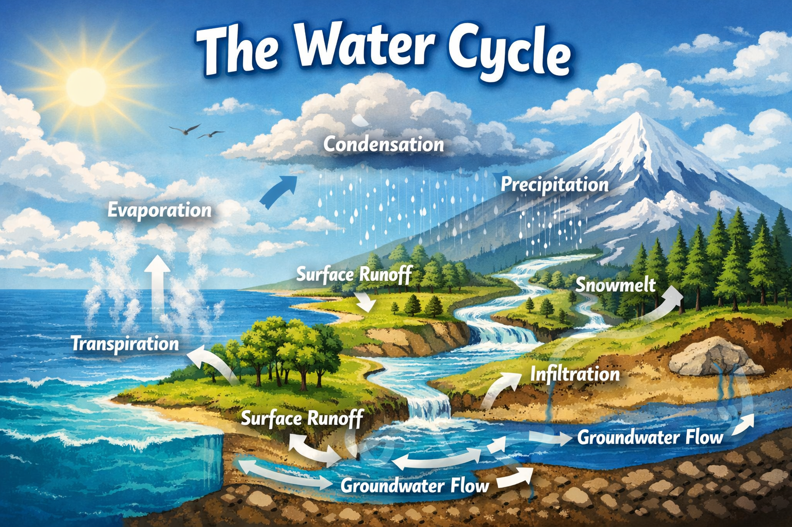

# Lesson 2: Understanding the Water Cycle

**Grade Level:** 4th and 5th Grade  
**Subject:** Science  
**Duration:** 1 hour  

---

## OVERVIEW
This lesson engages students in discovering the processes of the water cycle through an interactive, hands-on demonstration using a watershed model. Students will explore evaporation, condensation, precipitation, and collection by simulating rainfall, runoff, and evaporation, and observing how water moves through Earth’s system. The lesson follows an inquiry-based approach encouraging curiosity, discussion, and critical thinking.

---

## OBJECTIVES
By the end of the lesson, students will be able to:
- Identify and describe the four stages of the water cycle: **evaporation**, **condensation**, **precipitation**, and **collection**.
- Demonstrate understanding of how water moves through the environment using a physical model.
- Explain the importance of the water cycle in supporting life on Earth.
- Connect local examples (mountains, rivers, rain, groundwater) to each stage of the cycle.

---

## MATERIALS
- Watershed model (or tray setup to represent terrain)  
- Spray bottles to simulate rainfall  
- Ice blocks (to represent snow and melting)  
- Kettle or beaker with boiling water (for evaporation)  
- Glass of water with ice cubes (for condensation)  
- Video clip demonstrating the water cycle  
- Art supplies (poster paper, markers) or digital presentation tools  
- Quiz sheets and reflection sheets  

---

## PROCEDURE

### 1) Engage (5 minutes)
Show a short **2–3 minute** video of the water cycle. Ask questions:
- Where does rain come from?
- What happens to water after it rains?

### 2) Explore (20 minutes)
Demonstrate using the **watershed model**:
- Use sprayers to create “rainfall.”  
- Observe how water flows across the landscape as **runoff** and **collects** in lower areas.  
- Place **ice blocks** at the peaks to represent snow and melting.  
- **Boil water** in a small container to show **evaporation**.  
- Use a **glass with ice** to show **condensation** forming on the outside.  

Discuss what students see and how each process connects.

### 3) Explain (10 minutes)
Use a diagram or slides to label and define each stage of the water cycle. Emphasize terms: *evaporation, condensation, precipitation, collection, runoff, infiltration,* and *cloud formation*.

### 4) Elaborate (15 minutes)
- Divide students into small groups. Each group creates a **poster** or **digital slide** illustrating one stage of the water cycle.  
- Groups present their work and describe how their stage fits into the whole system.

### 5) Evaluate (10 minutes)
- Administer a short quiz or oral Q&A.  
- Have students write a short reflection on what they learned and why the water cycle is essential.

---

## ASSESSMENT
- Observation of student participation and inquiry during demonstration.  
- Group presentation accuracy and clarity.  
- Short quiz assessing understanding of the four stages.  
- Reflective paragraph demonstrating comprehension and relevance.  

---

## RESOURCES
**Standards Alignment**
- **NGSS 5-ESS2-1:** Develop a model to describe the movement of matter among plants, animals, decomposers, and the environment.  
- **CCSS ELA-Literacy.RI.5.7:** Analyze how visual and multimedia elements contribute to understanding.

**Suggested Links**
- Water Cycle Classroom Resources – NOAA/NASA  
- Interactive Water Cycle Diagram – USGS  

---

*Water Cycle*  
> **Jayanga T. Samarasinghe** 
> *Ph.D. Candidate in Environmental Science and Engineering* 
> *CIELO-G Research Associate Fellow* 
> *The University of Texas at El Paso* 
