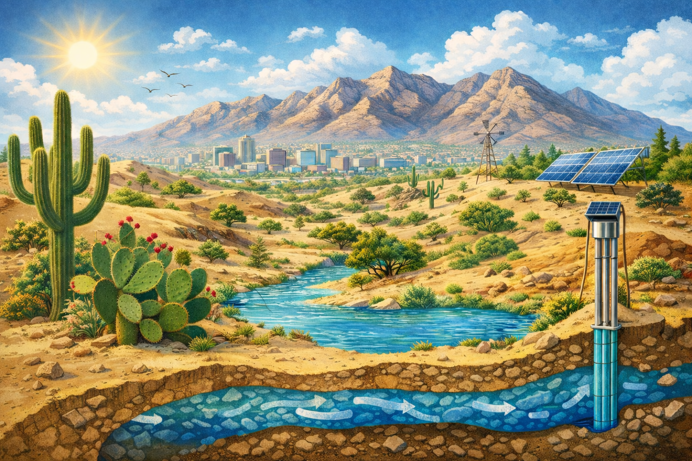

# **Lesson 3: The Importance of Water Resources in Desert Environments**
**Grade Level:** 4th and 5th Grade  
**Subject:** Science  
**Duration:** 1 hour  

---

## **LEARNING OBJECTIVE**
Students will be able to explain the significance of water resources in desert environments, particularly in El Paso, Texas.

---

## **ASSESSMENTS**
Students will create a poster that illustrates the role of water in sustaining life in desert ecosystems and present it to the class.

---

## **KEY POINTS**
- Water scarcity in desert environments affects plant and animal life.  
- Adaptations of species in arid environments to conserve water.  
- The water cycle and its relevance to desert climates.  
- Human impact on water resources in desert areas.  

---

## **OPENING**
- Begin with a short video or image gallery showcasing the desert environment of El Paso, Texas.  
- Ask students: **"What do you think would happen if there was no water in the desert?"**  

---

## **INTRODUCTION TO NEW MATERIAL**
- Discuss the water cycle briefly to illustrate how water moves through different states.  
- Explain how plants and animals adapt to survive with limited water.  
- Anticipate the misconception: **"All deserts are dry with no life."** Clarify that many plants and animals have special adaptations.  

---

## **GUIDED PRACTICE**
- Engage students in a discussion about how different animals, like cacti and camels, survive in the desert.  
- Provide scenarios and ask students how these animals might manage without water.  

---

## **CLOSING**
- Conduct a quick round of **"water facts"** where students share one fact they learned about water in deserts.

---

## **STANDARDS ALIGNED**
- **TEKS 4.10A:** Explore and illustrate the processes of the water cycle.  
- **TEKS 4.10B:** Investigate how organisms in desert environments adapt to survive with limited water.

---

# **HANDS-ON ACTIVITY**
---

## **Goal**
Students will build a simple pump well model to understand how groundwater is pumped to the surface and why protecting underground water is important.

---

## **Build a Well (20 minutes)**
1. Fill your cup ¾ full with sand (add pebbles for extra detail).  
2. Slowly pour water into the cup until it just covers the surface.  
3. Stick a straw down into the sand  
4. Use a pipette or another straw to suck water up from the straw well.  
5. Watch: Can you get water from below the surface?  

---

## **Materials Needed**
- 1 clear plastic cup (or small clear container)  
- Sand, pebbles/little rocks  
- Water  
- 1 straw or pump-top  
- 1 dropper or pipette  
- Paper towels (for spills)  

---

## **Key Vocabulary**
- Groundwater  
- Aquifer  
- Pump  
- Well  
- Pollution  
- Soil  
- Geoscientist

---

*The Importance of Water Resources in Desert Environments*  
> **Miriam Garcia-Dena**  
> *Ph.D. Student in Geological Science*  
> *CIELO-G Research Associate Fellow*
> *The University of Texas at El Paso*  
