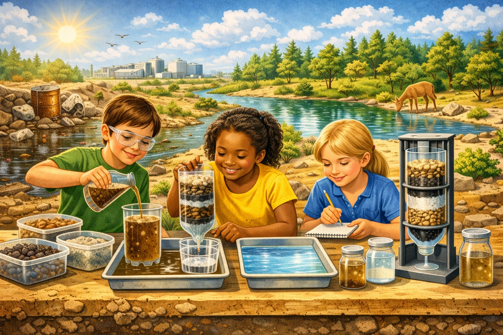

# Lesson 4: Water Purification — Filtering for Clean Water

**Grade Level:** 4th and 5th Grade  
**Subject:** Science  
**Duration:** 1 Hour  

---

## OVERVIEW
Students explore the importance of clean water and learn how filtration helps remove contaminants. Using everyday materials such as sand, gravel, and charcoal, they construct and test simple water filters. The activity highlights how science and engineering solve real-world problems related to environmental health and access to safe water.

---

## OBJECTIVES
By the end of this lesson, students will be able to:
- Explain why **clean water** is vital for life and health.  
- Describe the **process of filtration** and how it differs from purification.  
- Identify **materials** that help clean water effectively.  
- Construct and test a **simple water filter** using natural materials.  
- Discuss real-world challenges in providing clean water globally.

---

## MATERIALS
- **Sand**  
- **Gravel or small pebbles**  
- **Activated charcoal** (aquarium charcoal works well)  
- **Coffee filters or paper towels**  
- **Clear plastic bottles** (cut in half)  
- **“Contaminated” water samples** — clean water mixed with dirt, food coloring, or leaves  
- **3D printed model** of a filtration setup (optional visual aid)  
- **Tray or basin** (to catch filtered water)  
- **Timer, markers, and notebooks** for recording results  

---

## PROCEDURE

### 1) Engage (10 minutes)
- Show a short video or photo slideshow of **polluted vs. clean water** sources around the world.  
- Ask:
  - Why is clean water important?  
  - What could happen if people drink dirty water?  
  - How do you think we can clean it?  

---

### 2) Explore (25 minutes)
**Hands-On Activity: Build a Water Filter**
1. In small groups, provide each student team with a **cut plastic bottle** as the main filter body.  
2. Layer the materials inside in this order:  
   - Coffee filter or paper towel (bottom layer)  
   - Activated charcoal  
   - Fine sand  
   - Gravel or pebbles (top layer)  
3. Pour the **contaminated water** through the filter and collect the filtered output in a tray.  
4. Compare before-and-after clarity.  
5. Discuss which materials trapped the most dirt and how layering affects results.

---

### 3) Explain (10 minutes)
- Define and compare:
  - **Filtration:** physical removal of solid particles.  
  - **Purification:** chemical or biological treatment for safety.  
- Introduce vocabulary: *contaminant, filtration, purification, pathogen, clean water.*  
- Show a short diagram or 3D printed demo of how professional filters and natural aquifers work.

---

### 4) Evaluate (15 minutes)
- Have students write short answers or discuss:
  - What made your filter most effective?  
  - What improvements would you make?  
  - Why is water purification important for health and the environment?  
- Optionally, use a mini quiz (3–5 questions) or have groups share results aloud.

---

## ASSESSMENT
- Observation of teamwork and filter construction.  
- Evaluation of filtered water clarity and reflection quality.  
- Short quiz or discussion for comprehension of purification concepts.

---

## RESOURCES
- **Standards Alignment:**  
  - NGSS 5-ESS3-1 — Identify and explain factors affecting water quality.  
  - NGSS 5-PS1-3 — Make observations and measurements to identify materials by their properties.  
- **Suggested Extensions:**  
  - Research modern water purification systems in different countries.  
  - Design a community filter model using recyclable materials.  
  - Compare home filters vs. classroom versions under a microscope (optional).  

---

*Water Purification — Filtering for Clean Water*  
> **Jayanga T. Samarasinghe** 
> *Ph.D. Candidate in Environmental Science and Engineering* 
> *CIELO-G Research Associate Fellow* 
> *The University of Texas at El Paso*
