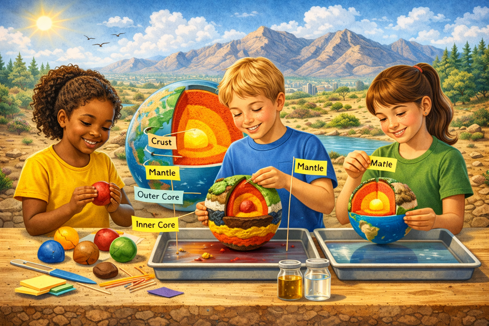

# **Lesson 5: Exploring the Layers of the Earth**
**Grade Level:** 4th and 5th Grade  
**Subject:** Science  
**Duration:** 1 hour  

---

## **LEARNING OBJECTIVE**
Students will be able to identify and describe the four layers of the Earth: crust, mantle, outer core, and inner core.

---

## **ASSESSMENTS**
Students will complete a simple quiz to assess their understanding of the Earth's layers and participate in a hands-on activity where they create a model of the Earth.

---

## **KEY POINTS**
- The Earth has four main layers: the crust, mantle, outer core, and inner core.  
- The crust is the outermost layer where we live.  
- The mantle is semi-solid and makes up a large portion of the Earth.  
- The outer core is liquid and is responsible for Earth's magnetic field.  
- The inner core is solid and extremely hot.  

---

## **OPENING**
- Begin with a question: **"What do you think is below our feet right now?"**  
- Show a short video clip of the Earth’s layers to grab students' attention.  
- Discuss students' initial thoughts and ideas about what lies beneath the Earth's surface.  

---

## **INTRODUCTION TO NEW MATERIAL**
- Use a diagram of the Earth’s layers to explain each layer in detail.  
- Engage students by asking them to describe what they think each layer might be made of.  
- Discuss the misconception that the Earth is solid all the way through; emphasize that it has both solid and liquid layers.  

---

## **GUIDED PRACTICE**
- Organize students into small groups to discuss the properties of each layer.  
- Provide each group with a set of materials to create a 3D model of the Earth.  

---

## **CLOSING**
- Conduct a quick review using a Kahoot quiz to recap the layers of the Earth and their characteristics.  
- Ask students to share one new fact they learned today.  

---

## **STANDARDS ALIGNED**
- **TEKS 4.5A:** Explore and explain how the Earth’s surface is constantly changing.  
- **TEKS 4.10A:** Investigate and compare the physical characteristics of the Earth's layers.  

---

# **HANDS-ON ACTIVITY**
---

## **Goal**
Students will build a simple 3D model of the layers of the Earth and label each one to show their understanding of Earth’s structure.

---

## **Build an Earth’s 3D Model (20 minutes)**
1. Roll small balls of different colors for each layer:  
   - Red = Inner Core  
   - Orange = Outer Core  
   - Yellow = Mantle  
   - Brown/green = Crust  
2. Stack them from inside out to form a ball.  
3. Cut it in half to see the cross-section.  
4. Use toothpicks and sticky notes to label each layer.  

---

## **Materials Needed**
- 4–5 colors of clay/dough  
- Plastic knife or craft stick  
- Toothpick & small label flags or sticky notes  

---

## **Key Vocabulary**
- Crust  
- Mantle  
- Outer Core  
- Inner Core  
- Heat  
- Rock  
- Metal  
- Earth
- 
---
*The Importance of Water Resources in Desert Environments*  
> **Miriam Garcia-Dena** 
> *Ph.D. Student in Geological Science* 
> *CIELO-G Research Associate Fellow* 
> *The University of Texas at El Paso*
