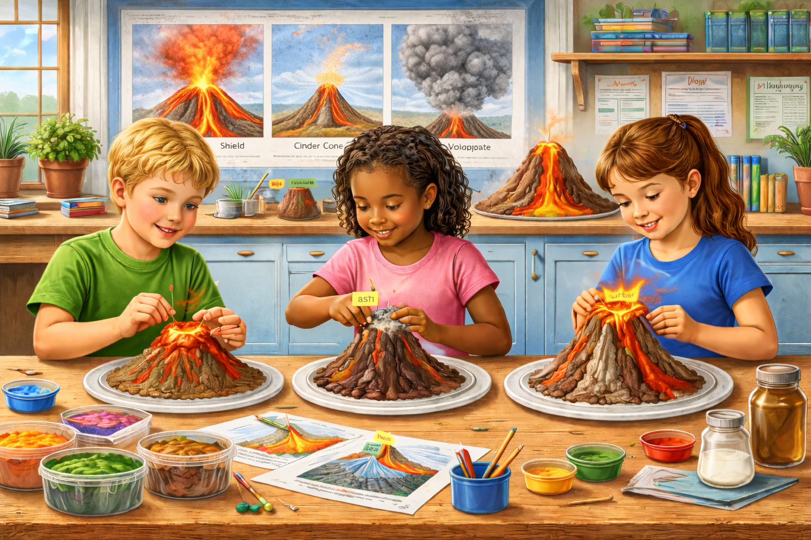

# **Lesson 8: Exploring Volcanoes**
**Grade Level:** 4th and 5th Grade  
**Subject:** Science  
**Duration:** 1 hour  

---

## **LEARNING OBJECTIVE**
Students will be able to identify and describe different types of volcanoes and their features.

---

## **ASSESSMENTS**
Students will create models of different types of volcanoes in groups and describe their characteristics.

---

## **KEY POINTS**
- **Types of Volcanoes:** Understand the three main types: shield, cinder cone, and composite.  
- **Volcano Features:** Learn about magma chambers, craters, and lava flows.  
- **Volcano Formation:** Discuss how volcanoes are formed through tectonic activity.  
- **Eruptions:** Recognize how and why volcanoes erupt, including different eruption styles.  

---

## **OPENING**
- Begin with a video showing a volcanic eruption to capture interest.  
- Ask students: **"What do you think happens inside a volcano?"** Encourage them to share their thoughts.  

---

## **INTRODUCTION TO NEW MATERIAL**
- Present slides explaining the types of volcanoes with images.  
- Use a model or diagram to show the internal structure of a volcano.  
- Address the misconception that all volcanoes are explosive; explain that some are gentle and create new land.  

---

## **GUIDED PRACTICE**
- Ask guiding questions, starting with **"What type of volcano did you choose?"** to **"How does this type erupt differently than others?"**  
- Monitor groups by circulating and checking for understanding.  

---

## **CLOSING**
- Conduct a quick review by asking students to share one new thing they learned about volcanoes.  

---

## **STANDARDS ALIGNED**
- **4.10(B):** Explore and explain how the Earth’s surface is shaped by various processes.  
- **4.10(D):** Investigate and record how changes in the Earth’s surface can occur through natural events.  

---

## **REFERENCE TABLES**

### **Table 1: Types of Volcanoes**
| Volcano Type | Shape / Appearance | Lava & Eruption Style | Common Features |
|---|---|---|---|
| Shield Volcano | Wide base, gentle slopes | Usually gentle eruptions; lava flows easily and spreads far | Broad lava flows, large size |
| Cinder Cone | Small, steep cone | Often short, explosive bursts that throw ash/cinders | Crater at the top, loose rock pieces |
| Composite Volcano | Tall, layered sides (steep + gentle layers) | Can be explosive or less explosive; built from alternating layers | Ash layers, lava layers, larger eruptions |

### **Table 2: Volcano Features**
| Feature | What It Is | Why It Matters |
|---|---|---|
| Magma Chamber | Underground storage area for melted rock | Supplies magma for eruptions |
| Crater | Bowl-shaped opening at the top | Where lava, ash, and gas can come out |
| Lava Flow | Melted rock moving on the surface | Builds new land and shapes the volcano |

---

# **HANDS-ON ACTIVITY**
---

## **Goal**
Students will model and label three major types of volcanoes and understand how their shapes relate to the type of eruption and lava flow.

---

## **Build Volcanoes (20 minutes)**
1. Use clay or dough to shape each volcano on your paper plate:  
   - **Shield Volcano:** wide base, gentle slope  
   - **Cinder Cone:** steep, small cone shape  
   - **Composite Volcano:** tall with both steep and gentle layers  
2. Use different colors or textures for each model.  
3. Add labels using toothpicks and sticky flags or small paper squares:  
   - Label each type by name.  
   - Bonus: Add labels like **“lava,” “ash,” or “crater.”**  

---

## **Table 3: Hands-on Model Guide**
| Model Volcano | Clay Shape Guide | Labels to Add (Suggested) |
|---|---|---|
| Shield Volcano | Wide base, gentle slope | crater, lava |
| Cinder Cone | Small, steep cone shape | crater, ash |
| Composite Volcano | Tall cone with layered look | crater, lava, ash |

---

## **Materials Needed**
- 4-5 colors of clay/dough  
- Paper plate or cardboard base (to build on)  
- Plastic knife or craft stick  
- Toothpick & small label flags or sticky notes  
- Printed mini volcano diagrams (for reference)  

---

## **Key Vocabulary**
- Volcano  
- Shield Volcano  
- Cinder Cone  
- Composite Volcano  
- Lava  
- Ash  
- Eruption  
- Crater  
- Magma

---
*Exploring Volcanoes*  
> **Miriam Garcia-Dena** 
> *Ph.D. Student in Geological Science* 
> *CIELO-G Research Associate Fellow* 
> *The University of Texas at El Paso*
