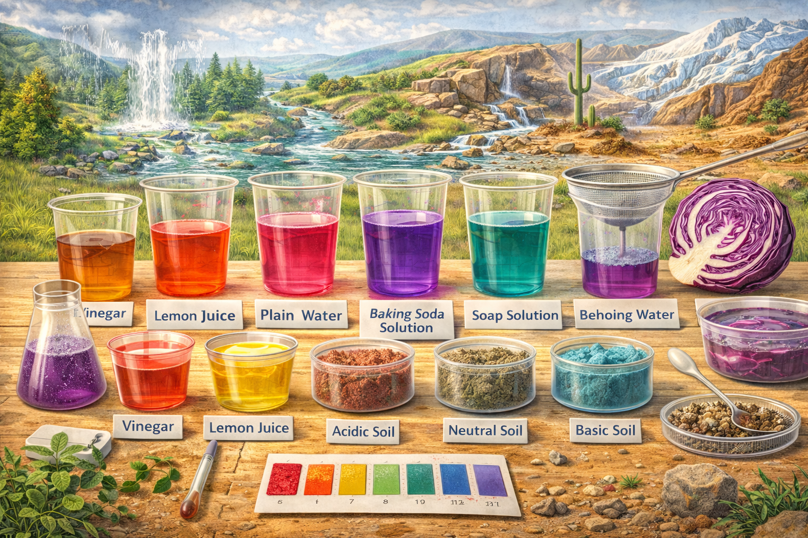

# Lesson 9: Exploring the Colors of Nature — Acid-Base Detection in Geosciences

**Grade Level:** 4th and 5th Grade  
**Subject:** Science  
**Duration:** 1 Hour  

---

## OVERVIEW
Students explore how colors in nature reveal chemical properties of substances, focusing on acids and bases found in natural materials. Using **red cabbage pH indicator**, **soil samples**, and a **geoscience perspective**, students test how different environments affect color changes and soil pH. The activity connects chemistry to the **Earth system**, showing how soil composition and acidity influence ecosystems.

---

## OBJECTIVES
By the end of the lesson, students will be able to:
- Explain how colors can indicate the presence of **acids** and **bases**.  
- Create a natural **pH indicator** using red cabbage.  
- Test and compare the **pH levels** of different liquids and soils.  
- Describe how soil pH affects plant growth and environmental conditions.  
- Relate acidity and color to **geoscience applications**, such as soil health and erosion.

---

## MATERIALS
- Red cabbage (chopped)  
- Boiling water and heat-safe container  
- Clear cups or beakers  
- Liquids for testing: vinegar, lemon juice, soap solution, baking soda water, plain water  
- Soil samples from various locations (playground, garden, etc.)  
- Strainer or coffee filter  
- **3D printed landscape models** (optional for soil testing visualization)  
- **Tray with sand**, **water**, **ice cubes**, and **straw/fan** (for showing how moisture and erosion affect pH distribution)  
- Paper towels and spoons  
- Notebooks or recording sheets  

---

## PROCEDURE

### 1) Engage (10 minutes)
- Show a slideshow or short video of **colorful natural materials** (flowers, soils, fruits).  
- Ask:
  - Why do you think some flowers are red while others are blue?  
  - What might cause soil to have different colors in different places?  

---

### 2) Explore (25 minutes)
**Red Cabbage Indicator Experiment**
1. Place chopped red cabbage in hot water to extract pigment.  
2. Strain and collect the purple liquid (indicator).  
3. Pour indicator into clear cups and add:
   - Vinegar → red color (acidic)  
   - Baking soda → green/blue color (basic)  
   - Lemon juice, soap solution, etc.  
4. Discuss which substances are **acidic** and which are **basic**.

**Geoscience Connection:**
- Collect small **soil samples** and mix each with a small amount of indicator.  
- Observe color changes and identify soil pH.  
- Use **3D printed terrain** and **sand trays** to visualize how rain (water), melting ice, and wind might move or alter soil acidity.

---

### 3) Explain (10 minutes)
- Introduce key vocabulary: *acid, base, pH, indicator, soil composition.*  
- Explain the science behind pH color changes and why different soils produce different reactions.  
- Connect to **real-world examples**: how soil acidity affects plants, crops, and erosion.

---

### 4) Evaluate (15 minutes)
- Students complete a quick reflection or report including:
  - What colors did you observe for each material?  
  - Which samples were most acidic or basic?  
  - How does pH relate to the environment?  
- Group sharing or short oral presentations.

---

## ASSESSMENT
- Observation of student engagement and proper use of materials.  
- Written reflections or mini reports summarizing findings.  
- Discussion participation and understanding of the link between **chemistry** and **geoscience**.  

---

## RESOURCES
- **Standards Alignment:**  
  - NGSS 5-PS1-3 — Make observations to identify materials based on their properties.  
  - NGSS 5-ESS2-1 — Model the composition and processes shaping Earth’s materials.  
- **Recommended Extensions:**  
  - Test water samples from local sources.  
  - Create color charts for field-based pH detection.  
  - Explore how acid rain impacts local soils or rocks.

---

*Exploring the Colors of Nature — Acid-Base Detection in Geosciences*  
> **Jayanga T. Samarasinghe** 
> *Ph.D. Candidate in Environmental Science and Engineering* 
> *CIELO-G Research Associate Fellow* 
> *The University of Texas at El Paso*
