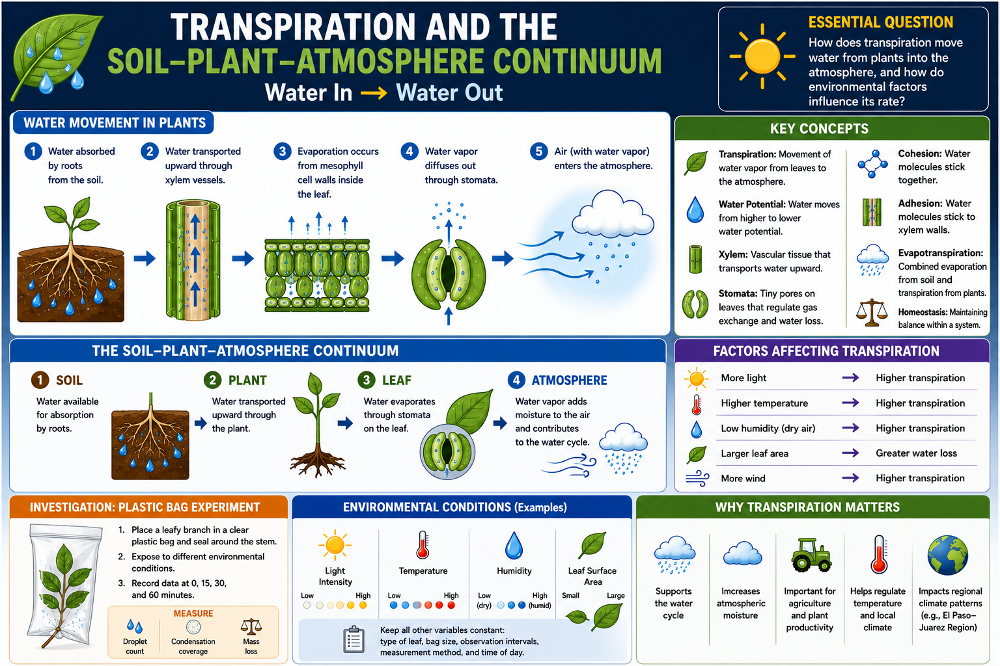

# Lesson 1: Transpiration and the Soil-Plant-Atmosphere Continuum

**Grade Level:** 11th Grade  
**Subject:** Biology / Ecohydrology  
**Duration:** Two Class Periods (90-120 minutes total)  
**Unit:** Plant Systems and Cycling of Matter  
**Educator Name:** Luis Tinajero  
**Fellow:** Jesus M. Ochoa-Rivero  
**Program:** Journey Through an Agroforest: Inside, Outside, and Beyond - Cielo-G  

---

# OVERVIEW

This lesson engages students in discovering the process of transpiration through an inquiry-based, hands-on experiment using leafy branches and plastic bags. Students will explore how water moves from the soil, through the plant, and into the atmosphere, while designing a controlled experiment to measure transpiration rate under different environmental conditions. The lesson follows an Engage-Explore-Explain-Elaborate-Evaluate (5E) approach, connecting plant-level water loss to the broader water cycle, agriculture, and regional (El Paso-Juarez Region) climate patterns.

Relation with Research: This lesson links to ecohydrology research examining how transpiration regulates water movement from plants to the atmosphere under varying environmental conditions. The student experiment reflects the same principles used in scientific studies of plant water use, showing how leaf-level processes scale up to influence the water cycle, agriculture, and regional climate.

---

# OBJECTIVES

Students will be able to:

- Define transpiration and explain it using the concept of water potential gradients.
- Describe the structure and function of stomata in regulating water loss.
- Design and conduct a controlled experiment to measure transpiration.
- Calculate and compare rates of transpiration using quantitative data.
- Construct a scientific explanation using the Claim-Evidence-Reasoning (CER) framework.
- Explain how transpiration contributes to the water cycle and influences regional climate patterns.

**Essential Question:** How does transpiration move water from plants into the atmosphere, and how do environmental factors influence its rate?

**Key Vocabulary:** Transpiration, water potential, cohesion, adhesion, xylem, stomata, guard cells, evapotranspiration, homeostasis.

---

# MATERIALS

- Fresh leaves or small leafy branches (e.g. pecan leaves).
- Plastic bags (Ziploc type)
- String or tape
- Permanent marker
- Stopwatch or timer
- Thermometer
- Digital balance
- Student data table handout
- Image or short video of dew formation / fog rising from a forest

---

# PROCEDURE

## 1) Engage (10 minutes)

Display an image or short video showing dew formation on leaves or fog rising from a forest. Ask questions:

- Where does the water on the leaf surface originate?
- How did it reach the leaf?
- Where does it go afterward?

Students engage in a brief Think-Pair-Share discussion. State the lesson objective: "Today we will investigate how plants move water into the atmosphere and measure this biological process using experimental data."

## 2) Explore (30-40 minutes)

Guide students through experimental design:

- Students select one independent variable: light intensity, temperature, humidity, or leaf surface area.
- Dependent variable: measured condensation (droplet count, percentage of bag surface covered, or mass loss).
- Controlled variables: type of leaf, size of plastic bag, observation intervals, measurement method, time of day.

Procedure:

1. Place a healthy leaf or small branch inside a clear plastic bag.
2. Seal the bag securely around the stem without crushing the leaf.
3. Place the setup under the assigned environmental condition.
4. Record data at 0, 15, 30, and 60 minutes, measuring droplet count, condensation coverage, or change in mass, along with temperature and light exposure.

## 3) Explain (15-20 minutes)

Use direct instruction to define and label each part of the process. Emphasize terms: transpiration, water potential gradient, stomata, xylem, cohesion, adhesion, evapotranspiration.

Cover the Soil-Plant-Atmosphere Continuum:

1. Water is absorbed by plant roots from the soil.
2. Water moves upward through xylem vessels.
3. Evaporation occurs from mesophyll cell walls inside the leaf.
4. Water vapor diffuses out through stomata.
5. Water enters the atmosphere.

Explain the driving mechanism: water moves from regions of higher to lower water potential. Evaporation at the leaf surface creates tension that pulls water upward via cohesion and adhesion. Connect to the water cycle: transpiration contributes to evapotranspiration, increasing atmospheric moisture and influencing cloud formation, humidity, and precipitation patterns.

## 4) Elaborate (Second Class Period - Independent Practice)

- Students calculate transpiration rate (droplet count divided by time, or change in mass divided by time).
- Students graph results: label x-axis as Time (minutes), y-axis with the transpiration measure and units, plot control and experimental conditions, draw a best-fit line, and calculate the slope (rate of transpiration).
- Students calculate averages across trials, compare experimental results with control data, identify trends and patterns, and complete a CER-based written conclusion.
- Students identify at least two potential sources of experimental error.
- Differentiation for ELLs: provide a vocabulary support sheet and sentence starters for CER responses.
- Differentiation for Advanced Learners: normalize transpiration rate per unit leaf area, estimate transpiration per square meter of vegetation, and analyze implications for drought conditions in Texas.

## 5) Evaluate (10-15 minutes)

Exit Ticket:

1. Define transpiration using the term "water potential gradient."
2. Based on your data, which condition produced the highest transpiration rate and why?

Closure discussion: How does transpiration at the plant level influence atmospheric moisture and regional climate patterns? Conclude by connecting transpiration to water availability and drought conditions in Texas ecosystems.

---

# ASSESSMENT

**Formative Assessment**

- Exit ticket questions on water potential gradient and experimental results.

**Summative Assessment - Laboratory Report**

Students submit a formal lab report including:

- Hypothesis
- Identification of variables
- Data table
- Graph with labeled axes
- Rate calculations
- Claim-Evidence-Reasoning explanation
- Two sources of experimental error and suggested improvements
- Explanation connecting transpiration to the water cycle

**Homework Assignment**

One-page laboratory reflection including a restated hypothesis, summary of methods, cleaned data table and graph, rate calculation, CER conclusion, two design improvements, and an explanation of how transpiration contributes to regional water cycling.

---

# RESOURCES

**Standards Alignment**

- TEKS B.6 (B): Analyze the cycling of matter and flow of energy through biological systems.
- TEKS B.7 (A): Analyze and evaluate how environmental factors affect photosynthesis and cellular respiration.
- TEKS B.11 (A): Analyze the role of internal and external stimuli in maintaining homeostasis.
- Texas CCRS: Interpret and analyze quantitative data; construct scientific explanations using evidence; develop and interpret graphical representations of data.

# Suggested Links

- Scientific Paper: Asbjornsen, H. et al. (2011). "Ecohydrological advances and applications in plant–water relations research: a review." Journal of Plant Ecology, Oxford Academic.https://academic.oup.com/jpe/article/4/1-2/3/943258
- YouTube Video: https://www.youtube.com/watch?v=5jJLfwTkGe8

---

Ecohydrology - Transpiration

**Jesus M. Ochoa-Rivero**  
<CIELO-G Research Associate Fellow>  
<Bowie High School, El Paso, TX>

