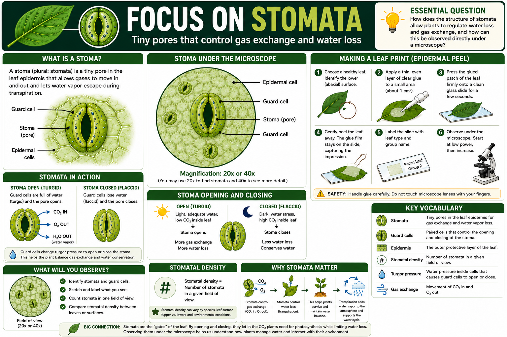

# Lesson 2: Observing Stomata Under the Microscope Using Leaf Prints

**Grade Level:** 11th Grade  
**Subject:** Biology  
**Duration:** One Class Period (50-60 minutes) - adjust to two periods if doing extended data analysis  
**Unit:** Plant Systems and Cycling of Matter  
**Educator Name:** Luis Tinajero  
**Fellow:** Jesus M. Ochoa-Rivero  
**Program:** Journey Through an Agroforest: Inside, Outside, and Beyond - Cielo-G  

---

# OVERVIEW

This lesson connects to the transpiration lesson by having students directly observe the structures responsible for water loss and gas exchange: the stomata and guard cells. Students will create a leaf print (epidermal peel) using clear glue (e.g. Kola Loka) and clear tape on a glass slide, then examine it under a compound microscope. Students will identify stomata and guard cells, count stomatal density, and relate these observations to transpiration rate and plant adaptation to environmental conditions.

---

# OBJECTIVES

By the end of the lesson, students will be able to:

- Identify stomata and guard cells on a prepared leaf print slide using a compound microscope.
- Describe the structure and function of stomata and guard cells in gas exchange and water regulation.
- Prepare a microscope slide using proper technique, including correct use of glue, tape, slide, and coverslip.
- Estimate stomatal density (number of stomata per field of view) and relate it to leaf surface and environmental adaptation.
- Connect stomatal structure and function to transpiration and the water cycle.

**Essential Question:** How does the structure of stomata allow plants to regulate water loss and gas exchange, and how can this be observed directly under a microscope?

**Key Vocabulary:** Stomata, guard cells, epidermis, leaf print, magnification, field of view, stomatal density, turgor pressure, gas exchange.

---

# TEXAS ESSENTIAL KNOWLEDGE AND SKILLS (TEKS) ALIGNMENT

**Biology TEKS:**

- TEKS B.2 (F): Collect and organize qualitative and quantitative data and make measurements with accuracy and precision using tools such as microscopes and various prepared slides.
- TEKS B.4 (B): Investigate and explain cellular processes, including homeostasis and transport of molecules.
- TEKS B.7 (A): Analyze and evaluate how environmental factors affect photosynthesis and cellular respiration.
- TEKS B.11 (A): Analyze the role of internal and external stimuli in maintaining homeostasis.

**Texas College and Career Readiness Standards (CCRS):**

- Use microscopes and other laboratory equipment correctly and safely.
- Interpret and analyze quantitative and qualitative data.
- Construct scientific explanations using evidence.

---

# MATERIALS

- Fresh leaves (different species if possible, for comparison)
- Clear glue (e.g. Kola Loka)
- Clear cellophane tape
- Glass microscope slides
- Coverslips (optional, if using glue/water mount instead of tape)
- Compound microscopes
- Forceps
- Droppers and water
- Paper towels
- Permanent marker (for labeling slides)
- Student data table / observation handout
- Colored pencils (for sketching observations)

---

# PROCEDURE

## 1) Engage (5-10 minutes)

Show a microscope image or short video of stomata and guard cells. Ask questions:

- How do you think a plant "breathes" or releases water vapor?
- What structures might allow gases and water to move in and out of a leaf?

Brief Think-Pair-Share discussion. State the objective: "Today we will make our own slides to see the structures that control water and gas exchange in plants."

## 2) Explore (20-25 minutes) - Leaf Print Slide Preparation

Guide students through the leaf print procedure:

1. Select a healthy leaf and identify the lower (abaxial) surface, where most stomata are typically found.
2. Apply a thin, even layer of clear glue to a small area (about 1 square centimeter) of the lower leaf surface.
3. Press the glued patch of the leaf firmly onto a clean glass slide and hold it in place for a few seconds.
4. Gently peel the leaf away — the thin glue film should stay on the slide, carrying the impression of the leaf surface.
5. Label the slide with leaf type and group name.
6. Place the slide under the compound microscope, starting at low power and increasing magnification to locate and focus on stomata.

Safety note: handle glue, and microscope lenses carefully; avoid touching lenses directly; use in a ventilated area if using nail polish.

## 3) Explain (10-15 minutes)

Use direct instruction with labeled diagrams to define and describe:

- Stomata: small pores in the leaf epidermis that allow gas exchange (carbon dioxide, oxygen) and water vapor loss.
- Guard cells: paired, kidney- or bean-shaped cells that surround each stoma and control its opening and closing by changing turgor pressure.
- Epidermis: the outer protective cell layer of the leaf where stomata are located.
- Stomatal density: the number of stomata observed within a given field of view, which can vary by species, leaf surface, and environmental conditions (light, humidity, water availability).

Connect to transpiration: when guard cells are turgid (full of water), stomata open, allowing water vapor to escape (transpiration) along with gas exchange; when guard cells lose water, they become flaccid and the stomata close, conserving water.

## 4) Elaborate (10-15 minutes)

- Students sketch and label their observed stomata and guard cells, noting magnification used.
- Students count the number of stomata visible in one field of view and record this as a measure of stomatal density.
- If comparing multiple leaf types or leaf surfaces (upper vs. lower), students create a simple comparison table or graph of stomatal density.
- Discussion question: Which leaf or surface had more stomata, and what might explain the difference (such as habitat, sun exposure, or water availability)?
- Differentiation for ELLs: provide a labeled diagram word bank and sentence starters for descriptions.
- Differentiation for Advanced Learners: have students estimate total stomata per leaf by scaling up from the field-of-view count and leaf surface area, and relate this to potential transpiration rate.

## 5) Evaluate (5-10 minutes)

Exit Ticket:

1. Describe the function of guard cells in your own words.
2. Based on your slide, was stomatal density high or low, and what might this suggest about the plant's water needs or habitat?

---

# ASSESSMENT

**Formative Assessment**

- Observation of slide preparation technique and microscope use.
- Exit ticket responses on guard cell function and stomatal density interpretation.

**Summative Assessment - Lab Report or Worksheet**

Students submit a short lab report or worksheet including:

- Labeled sketch of stomata and guard cells observed
- Stomatal density count(s) with magnification noted
- Comparison data (if multiple leaves/surfaces used)
- A written explanation connecting stomatal structure to water regulation and the water cycle
- One source of potential error in slide preparation or observation

---

# RESOURCES

**Standards Alignment**

- TEKS B.2 (F), B.4 (B), B.7 (A), B.11 (A)
- Texas CCRS: laboratory equipment use, data interpretation, scientific explanation

**Suggested Links**

- Hub: https://www.stomatahub.com/
- YouTube Video: https://www.youtube.com/watch?v=Bf-RFPaZeAM

---

Ecohydrology - Stomata and Microscope Lab

Jesus M. Ochoa-Rivero  
CIELO-G Research Associate Fellow  
Bowie High School, El Paso, TX

