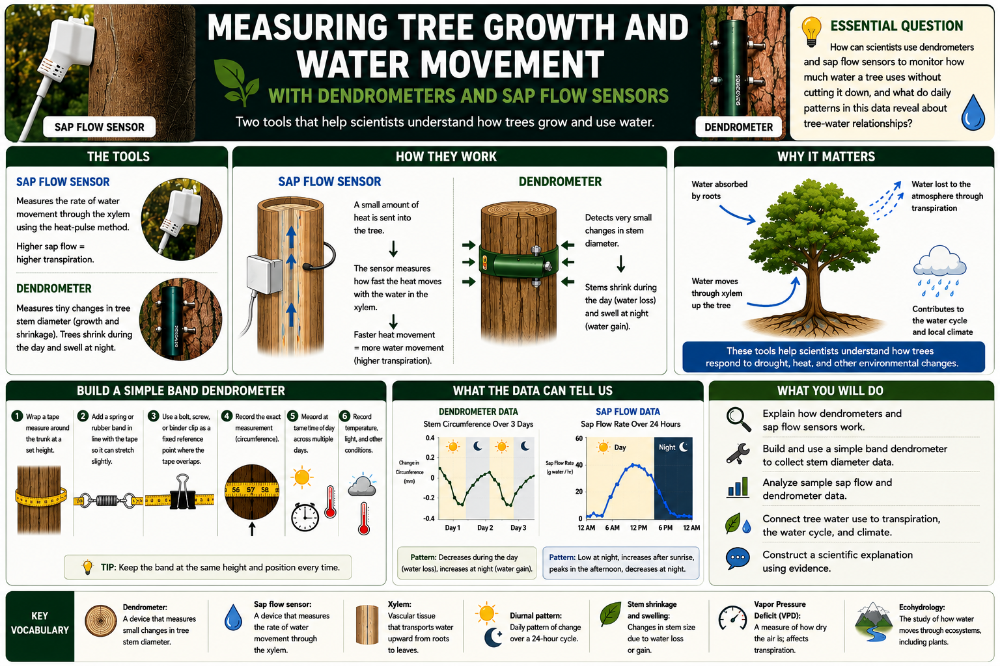

# Lesson 3: Measuring Tree Growth and Water Movement with Dendrometers and Sap Flow Sensors

**Grade Level:** 11th Grade  
**Subject:** Biology / Ecohydrology  
**Duration:** Two Class Periods (90-120 minutes total) - can be condensed to one period if using provided data sets only  
**Unit:** Plant Systems and Cycling of Matter  
**Educator Name:** Luis Tinajero  
**Fellow:** Jesus M. Ochoa-Rivero  
**Program:** Journey Through an Agroforest: Inside, Outside, and Beyond - Cielo-G  

---

# OVERVIEW

This lesson builds on the transpiration and stomata lessons by introducing two real ecohydrology field instruments: the dendrometer, which measures small changes in tree stem diameter, and the sap flow sensor, which measures the rate of water movement through the xylem. Students will learn how these tools allow scientists to monitor tree water status without harming the tree, build and use a simple DIY band dendrometer, and analyze sample sap flow data to connect daily and seasonal patterns of water use to environmental conditions such as light, temperature, and humidity.

Relation with Research: Dendrometers and sap flow sensors are core tools in ecohydrology research used to monitor how trees respond to drought, climate variability, and management practices such as agroforestry. By measuring stem diameter fluctuations and sap flow rates, researchers can scale up from a single tree to estimate water use across a forest or agroforest system, directly connecting tree physiology to the water cycle and regional climate.

---

# OBJECTIVES

By the end of the lesson, students will be able to:

- Explain how a dendrometer measures changes in tree stem diameter and what causes those changes.
- Explain how a sap flow sensor estimates the rate of water movement through the xylem.
- Construct and use a simple band dendrometer to collect stem diameter data.
- Interpret sample sap flow and dendrometer data to identify daily (diurnal) patterns of water use.
- Connect tree-level water use to transpiration, the water cycle, and regional climate patterns.

**Essential Question:** How can scientists use dendrometers and sap flow sensors to monitor how much water a tree uses without cutting it down, and what do daily patterns in this data reveal about tree-water relationships?

**Key Vocabulary:** Dendrometer, sap flow sensor, xylem, diurnal pattern, stem shrinkage and swelling, water potential, vapor pressure deficit (VPD), heat-pulse method, ecohydrology.

---

# TEXAS ESSENTIAL KNOWLEDGE AND SKILLS (TEKS) ALIGNMENT

**Biology TEKS:**

- TEKS B.2 (F): Collect and organize qualitative and quantitative data and make measurements with accuracy and precision using tools such as data-collecting probes and standard laboratory equipment.
- TEKS B.6 (B): Analyze the cycling of matter and flow of energy through biological systems.
- TEKS B.7 (A): Analyze and evaluate how environmental factors affect photosynthesis and cellular respiration.
- TEKS B.11 (A): Analyze the role of internal and external stimuli in maintaining homeostasis.

**Texas College and Career Readiness Standards (CCRS):**

- Interpret and analyze quantitative data.
- Construct scientific explanations using evidence.
- Develop and interpret graphical representations of data.

---

# MATERIALS

- Sample dendrometer data set (printed graph or spreadsheet showing stem diameter over several days)
- Sample sap flow data set (printed graph or spreadsheet showing sap flow rate over a 24-hour period)
- Images or short video of real dendrometers and sap flow sensors installed on trees
- For DIY band dendrometer: flexible measuring tape or fabric tape measure, spring or rubber band, small bolt/screw or binder clip, string
- Trees or large potted plants on or near campus (for the DIY dendrometer activity)
- Thermometer and light meter or weather app (to record environmental conditions during data collection, if doing live measurements)
- Student data table / observation handout
- Graph paper or graphing software

---

# PROCEDURE

## 1) Engage (10 minutes)

Show images or a short video of a dendrometer band and a sap flow sensor installed on a tree trunk. Ask questions:

- How could scientists measure how much water a tree is using without cutting it down?
- Do you think a tree's trunk size changes during the day? Why or why not?

Brief Think-Pair-Share discussion. State the objective: "Today we will explore two tools researchers use to monitor how trees grow and use water, and we will build a simple version of one of them."

## 2) Explore (30-40 minutes)

Part A - Understanding the Instruments

Present background information:

- A dendrometer is a band or sensor wrapped around a tree trunk that detects very small changes in stem diameter, often less than one millimeter. Stems shrink slightly during the day as water is pulled out for transpiration and swell slightly at night as the tree rehydrates.
- A sap flow sensor uses small heat probes inserted into the trunk (heat-pulse method) to measure how fast water moves upward through the xylem. Faster sap flow generally means higher transpiration rates.

Part B - Building a Simple Band Dendrometer

Guide students through constructing a basic mechanical dendrometer:

1. Wrap the flexible tape measure snugly around the trunk of a tree or large potted plant at a marked, consistent height.
2. Attach a spring or rubber band section in line with the tape so the band can flex slightly as the trunk changes diameter.
3. Mark a fixed reference point (such as a binder clip or bolt) where the tape overlaps, and record the exact measurement reading.
4. Record the circumference reading at the same time of day across multiple days (or morning vs. afternoon on the same day, if time allows), along with temperature and light conditions.
5. Calculate diameter change using: Diameter = Circumference ÷ 3.14 (pi)

## 3) Explain (15-20 minutes)

Use direct instruction with diagrams to connect the data to plant water physiology:

- During the day, transpiration pulls water out of the stem tissue faster than roots can replace it, causing the stem to shrink slightly (water deficit).
- At night, when stomata close and transpiration slows, the tree rehydrates and the stem swells back.
- Sap flow rate typically rises in the morning as the sun rises and stomata open, peaks around midday or early afternoon, and falls in the evening, following light intensity, temperature, and vapor pressure deficit (VPD).
- Both instruments allow researchers to estimate whole-tree water use and detect drought stress, since stressed trees often show reduced sap flow and reduced diameter recovery overnight.

## 4) Elaborate (15-20 minutes, can extend into Second Class Period)

- Provide students with a sample sap flow data set and a sample dendrometer data set covering a 24-48 hour period.
- Students graph the data, labeling the x-axis as Time and the y-axis with the appropriate measure and units.
- Students identify the time of peak sap flow and the time of minimum stem diameter, and discuss whether these align with each other and with peak temperature/light.
- Students compare their own DIY dendrometer measurements (if collected) to the sample sap flow pattern and discuss similarities or differences.
- Differentiation for ELLs: provide a vocabulary support sheet and a labeled diagram of the dendrometer and sap flow sensor.
- Differentiation for Advanced Learners: have students calculate the percentage change in stem diameter between day and night readings, or research how sap flow data is used to estimate evapotranspiration across an entire agroforest.

## 5) Evaluate (10-15 minutes)

Exit Ticket:

1. Explain why a tree's stem diameter might be slightly smaller in the afternoon than in the early morning.
2. Based on the sample sap flow data, during which part of the day was the tree using the most water, and what environmental factors might explain this?

---

# ASSESSMENT

**Formative Assessment**

- Observation of dendrometer construction and measurement technique.
- Exit ticket responses connecting stem diameter changes and sap flow timing to environmental conditions.

**Summative Assessment - Data Analysis Report**

Students submit a short report including:

- Graph of sap flow data and/or dendrometer data with labeled axes
- Identification of peak and minimum values and their timing
- A written explanation connecting tree water-use patterns to transpiration and the water cycle
- One way this method could be used to detect drought stress in trees
- One source of potential error in the DIY dendrometer measurement (if collected)

---

# RESOURCES

**Standards Alignment**

- TEKS B.2 (F), B.6 (B), B.7 (A), B.11 (A)
- Texas CCRS: data interpretation, graphical representation, scientific explanation

**Suggested Links**

- Scientific Paper: Peters, R.L., Basler, D., Zweifel, R., Steger, D.N., Zhorzel, T., Zahnd, C., Hoch, G. and Kahmen, A. (2025), Normalized tree water deficit: an automated dendrometer signal to quantify drought stress in trees. New Phytol, 247: 1186-1198. https://doi.org/10.1111/nph.70266
- YouTube Video: https://www.youtube.com/watch?v=XRxm5DQ4uWI

---

Ecohydrology - Dendrometers and Sap Flow Sensors

Jesus M. Ochoa-Rivero  
CIELO-G Research Associate Fellow  
Bowie High School, El Paso, TX
