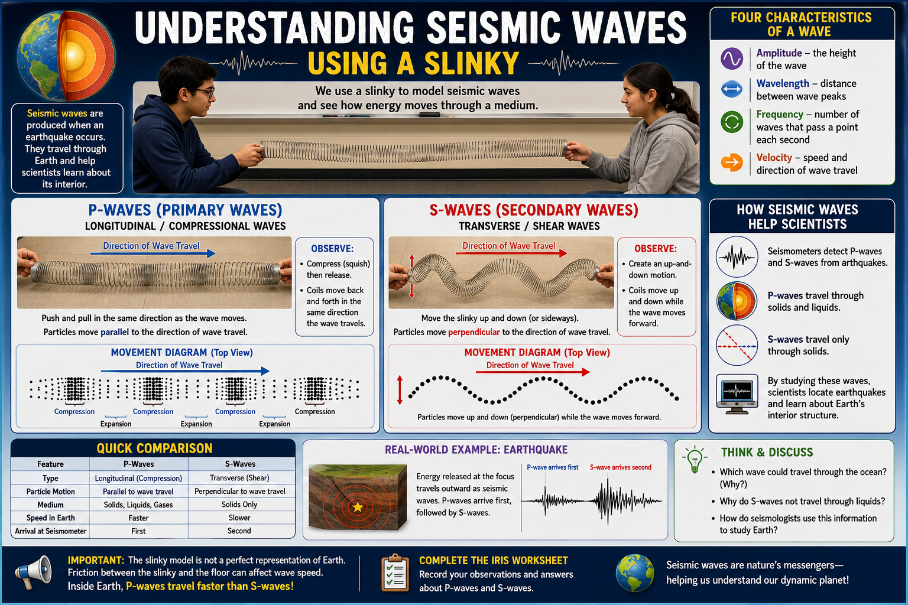

# Lesson 03 Understanding Seismic Waves Using a Slinky

**Grade Level:** 9th–12th Grade  
**Subject:** Science  
**Duration:** 45 minutes

---

## OVERVIEW

This lesson introduces students to how wave physics is applied to the study of Earth through seismology. Using a slinky model, students will observe and compare P-waves and S-waves. Students will identify the characteristics of longitudinal and transverse waves, examine particle motion and wave propagation, and record their observations on a worksheet. By connecting wave behavior to earthquakes, students will gain a better understanding of how seismologists study Earth's interior.

---

## OBJECTIVES

By the end of the lesson, students will be able to:

- Identify and describe the four main characteristics of a wave.
- Compare longitudinal (P) waves and transverse (S) waves.
- Explain how seismic waves help scientists study Earth's interior.
- Demonstrate their understanding by completing the IRIS worksheet.

---

## MATERIALS

- Introductory PowerPoint presentation
- One metal slinky
- IRIS Seismic Waves worksheet
- Computer and projector or interactive whiteboard
- Open floor space for demonstration

---

## PROCEDURE

### 1. Engage (10 minutes)

- Present a short four-slide PowerPoint introducing seismic waves.
- Ask students the following questions:
  - What are the characteristics of a wave?
  - What waves are produced when an earthquake occurs?
  - Which seismic wave travels through both solids and liquids?
  - How do particle motion and wave propagation direction compare?
  - What type of wave is this?

---

### 2. Explore (10 minutes)

- Demonstrate the slinky model with one student holding one end while the teacher holds the other end.
- Place the slinky on the floor and have students gather around to observe the wave motions.
- Demonstrate a **P-wave** by pinching 5–8 links of the slinky and releasing them suddenly to create a compressional wave.
- Ask students to describe what they observe:
  - Does the particle motion move parallel to the direction of wave travel?
- Demonstrate an **S-wave** by flicking one end of the slinky sideways to create a transverse wave.
- Again, ask students to describe what they observe:
  - How do the particle motion and wave propagation direction compare?

---

### 3. Explain (5 minutes)

- Use the slinky model to demonstrate how P-wave and S-wave motions differ.
- Have students observe the relative speed of each wave in the model.
- Explain that the slinky model is not a perfect representation of Earth because friction between the slinky and the floor affects wave speed.
- Discuss that, within Earth, **P-waves travel faster than S-waves**, even though the classroom model may show the opposite.
- Explain that seismologists analyze P-waves and S-waves to locate earthquakes and investigate Earth's internal structure.

---

### 4. Elaborate (15 minutes)

- Have students work in pairs to complete the IRIS worksheet.
- Encourage students to compare P-waves and S-waves using their observations from the demonstration.
- Have each pair briefly present their findings to the class.

---

### 5. Evaluate (5 minutes)

- Review worksheet responses through a brief class discussion.
- Collect the completed IRIS worksheets to assess student understanding.

---

## ASSESSMENT

- Observation of student participation and inquiry during the slinky demonstration.
- Accuracy and clarity of group discussions and presentations.
- Completed IRIS worksheet demonstrating understanding of P-waves, S-waves, and wave characteristics.

---

## RESOURCES

### Standards Alignment

**P.8B**
- Compare the characteristics of transverse and longitudinal waves, including electromagnetic and sound waves.

**P.8C**
- Investigate and analyze characteristics of waves, including velocity, frequency, amplitude, and wavelength, and calculate using the relationships between wave speed, frequency, and wavelength.

### Suggested Links

- IRIS Earthquake Classroom Resources
- IRIS Seismic Waves Educational Resources
- USGS Earthquake Hazards Program

*Understanding Seismic Waves Using a Slinky*
> **Leah April** 
> *Ph.D. Candidate in Geology* 
> *CIELO-G Research Associate Fellow* 
> *The University of Texas at El Paso* 
