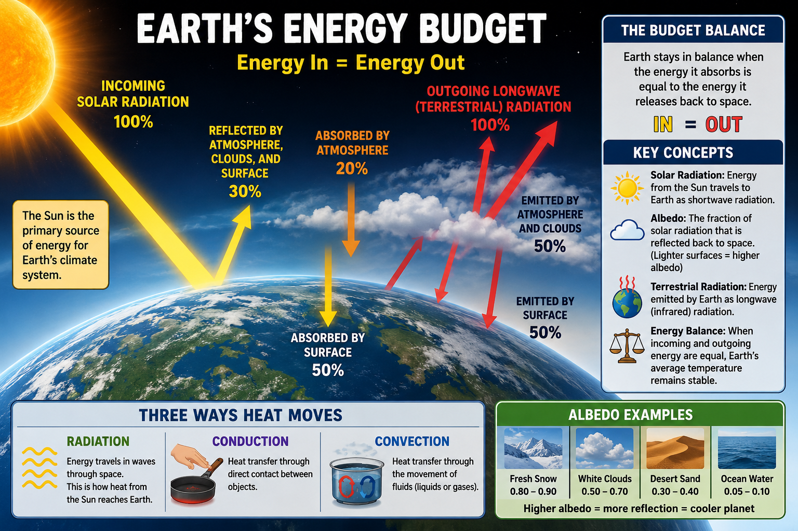

# Lesson 1: The Earth's Energy Budget

**Grade Level:** 9th–12th Grade  
**Subject:** Atmospheric and Climate Sciences  
**Duration:** 60 minutes

---

## OVERVIEW

This lesson introduces students to Earth's energy budget and the processes that regulate the planet's temperature. Students will investigate the balance between incoming solar radiation and outgoing terrestrial radiation while exploring the three mechanisms of heat transfer: radiation, conduction, and convection. Through real-world examples, students will examine why planets have different surface temperatures, investigate the Urban Heat Island effect in El Paso, and connect these concepts to ongoing atmospheric research.

### Research Connection

This lesson connects to current research investigating how **black carbon (soot)** and **mineral dust** influence Earth's radiative budget by either increasing or decreasing atmospheric temperatures. Students will see how the concepts learned in class relate directly to modern atmospheric and climate science research.

---

## OBJECTIVES

By the end of the lesson, students will be able to:

- Define Earth's energy budget and explain the concept of **Energy In = Energy Out**.
- Identify the three methods of heat transfer (radiation, conduction, and convection) and determine which process transfers energy from the Sun to Earth.
- Calculate a simplified radiation budget and predict how changes in albedo affect Earth's temperature.
- Compare the atmospheres of Mercury, Venus, and Earth to explain differences in planetary temperatures.
- Analyze local environmental data to identify the Urban Heat Island effect in El Paso.

---

## MATERIALS

- PowerPoint presentation
- "The El Paso Heat Detective" student handout
- Calculator (optional)
- Whiteboard and markers
- Computer and projector or interactive whiteboard

---

## PROCEDURE

### 1. Engage (10 minutes)

- Display images of several planets in the solar system and their distances from the Sun.
- Ask students the following questions:
  - Why is Venus hotter than Mercury even though Mercury is closer to the Sun?
  - What do you think determines a planet's temperature?
  - How does Earth's atmosphere influence its temperature?
- Conduct a **Think-Pair-Share** activity where students discuss why distance from the Sun is not the only factor affecting planetary temperature.

---

### 2. Explore (15 minutes)

- Introduce the three methods of heat transfer:
  - Radiation
  - Conduction
  - Convection
- Explain Earth's energy budget using the concept:
  - **Energy In = Energy Out**
- Introduce the Solar Constant and the concept of **Albedo**.
- Compare the atmospheres of Mercury, Venus, and Earth to explain why they have different surface temperatures.
- Ask students:
  - Which heat transfer process allows energy to travel from the Sun to Earth?
  - What happens if Earth absorbs more energy than it radiates?
  - How does albedo influence Earth's temperature?

---

### 3. Explain (15 minutes)

- Have students complete **The El Paso Heat Detective** activity.
- Ask students to answer the following questions:

  1. Which location has the lower (0.05) albedo? Why?

  2. Which type of heat transfer (radiation, conduction, or convection) best explains why the parking lot feels much hotter?

  3. If every dark roof and parking lot in downtown El Paso were painted the same light-tan color as the surrounding desert, what would happen to the city's temperature?

  4. Scientists call it an Urban ________ ________ when a city remains much hotter than the surrounding desert because of dark, human-made surfaces.

- Discuss the Urban Heat Island effect and how albedo influences local temperatures.

---

### 4. Elaborate (15 minutes)

- Discuss how changing Earth's surface properties affects its energy budget.
- Explain how atmospheric particles such as **black carbon (soot)** and **mineral dust** influence Earth's climate by changing the amount of incoming and outgoing radiation.
- Connect these concepts to current atmospheric and climate research.
- Ask students:
  - How might reducing black carbon emissions affect Earth's temperature?
  - Why is understanding Earth's energy budget important for climate science?

---

### 5. Evaluate (5 minutes)

- Ask students the following discussion question:

  **If we doubled the amount of white clouds covering Earth, would the planet become warmer or cooler? Explain your reasoning.**

- Collect and evaluate the completed **El Paso Heat Detective** handouts.

---

## ASSESSMENT

- Observation of student participation during discussions and classroom activities.
- Student responses during the Think-Pair-Share activity.
- Completion and accuracy of the **El Paso Heat Detective** worksheet.
- Student explanations of how albedo and heat transfer affect Earth's energy budget.

---

## RESOURCES

### Standards Alignment

#### Texas Essential Knowledge and Skills (TEKS)

**Environmental Systems TEKS**

**B.7(C)**
- Explain the flow of heat energy in an ecosystem, including conduction, convection, and radiation.

**C.6(D)**
- Investigate and demonstrate the movement of thermal energy through solids, liquids, and gases by convection, conduction, and radiation in weather, living, and mechanical systems.

#### Texas College and Career Readiness Standards (CCRS)

- Interpret and analyze quantitative data.
- Construct scientific explanations using evidence.
- Develop and interpret graphical representations of data.

### Suggested Resources

- NASA Earth Observatory
- NOAA Climate.gov
- NASA Climate Kids
- U.S. Environmental Protection Agency – Heat Island Effect

*The Earth's Energy Budget*
> **Valentina Sanchez Castano** 
> *Ph.D. Candidate in Environmental Science and Engineering* 
> *CIELO-G Research Associate Fellow* 
> *The University of Texas at El Paso* 

